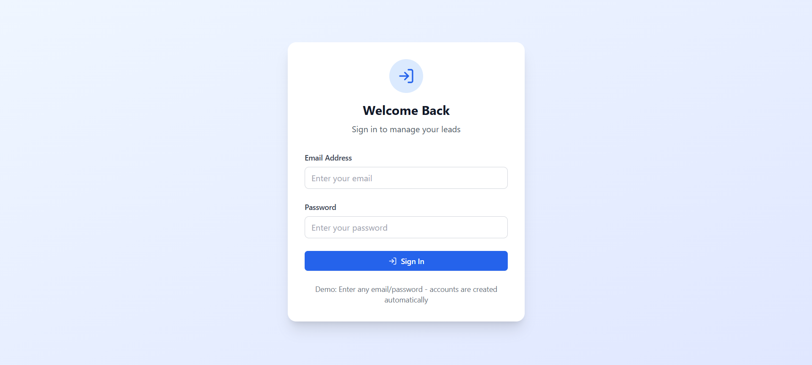
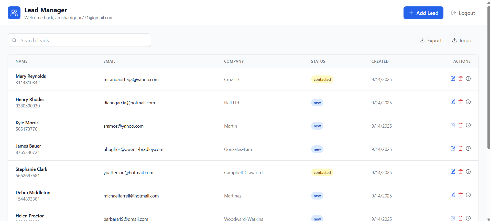

# Mini-Lead-Buyer-Management

## 🚀 Project Overview
The **Lead Manager App** is a modern web application built with **Next.js**, **TypeScript**, and **Supabase** to manage and track sales leads efficiently. It allows users to perform CRUD operations on leads, import/export lead data via CSV, and view lead details in a clean and responsive UI.

---

## 🎯 Features
- Add, edit, and delete leads
- Search leads by name, email, or company
- Import leads from CSV files
- Export lead data to CSV
- Paginated lead listing
- View detailed lead information in a modal
- Responsive design with a gradient glass effect in dark theme

---

## 🧱 Tech Stack
- **Frontend:** Next.js (App Router) + TypeScript + Tailwind CSS
- **Backend:** Supabase (Postgres database + Auth)
- **Icons:** lucide-react

---

## ⚡ Screenshots

---

## 🎯 Usage

- Add new leads using the **Add Lead** button.
- Search leads using the search input.
- Export existing leads into **CSV format**.
- Import leads by uploading a **CSV file**.
- View lead details by clicking the **info icon**.

---

